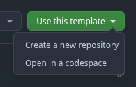
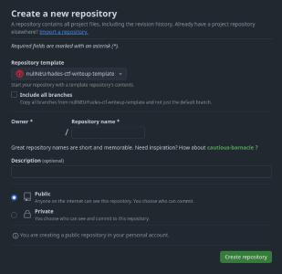

<!-- @DONOTEDIT -->
# Guidelines

One of the most telling signs of being a good cybersecurity analyst or software engineer is to document processes, techniques, and *hacks* employed to solve a problem. Now that you have successfully collaborated with Hera on tracking down the *insider* job at [Hades Enterprises](https://hadesenterprisesinc.com), it is your duty to document how you did it—along with any intutions you based your guesses upon or code you might have used.

Below are some general guidelines that you need to follow as you craft your write-up:
- Before you start documenting anything at all, fill out the details in the main [README.md](README.md) file so that you can focus on the challenges hereon.
- Each challenge sent by Hera lives in its own directory with a corresponding `README.md` file. **Do not** change this strucutre.
- Feel free to add sample code (in a different file or within the write-up) and screenshots to your write-ups. Assets related to a challenge should be placed in the corresponding challenge directory itself.

For the technical aspects themselves, here are some tips:
- Explain the task itself, so that someone without in-depth knowledge of the challenge can also understand the idea
- Don't assume something is *obvious* just because you find it on your first attempt (because it might not be so obvious for others)—explain your analysis of the task wherever you can
- Include intermediate steps or calculations (say, for cryptography)

> [!IMPORTANT]
> Any content placed between a pair of `@DONOTEDIT` tags should not be edited for the purposes of this writeup.

## Judging criteria

Write-ups will be judged for completeness, clarity and technique—in that order.

## Prizes

The best write-up will be featured on the [null NEU blog](https://nullneu.org/blog) with appropriate credits.

## Setting up the write-up template

In case you are stuck figuring out how to get this repository set up for your team, the following instructions should assist you:
- This is a [template repository](https://docs.github.com/en/repositories/creating-and-managing-repositories/creating-a-template-repository#about-template-repositories). So, anyone can create a copy of it and modify its contents. Once you are on the repository URL on GitHub, you can hit the *Use this template* button and choose *Create a new repository*.
  
  
> [!IMPORTANT]
> We require only one write-up per team, so only one person is required to create the repository and can add others as collaborators, if required.
- On the Create a new repository page, fill in the required details. Ensure that the repository is **Public**—otherwise we will not be able to judge the writeup.

   
> [!NOTE]
> Although you can name the repository as per your wishes, we recommend that you name it `<team-name>-hades-ctf-writeup` so that it is easily distinguishable.
<!-- image -->
- Create the repository and [add your team members](https://docs.github.com/en/account-and-profile/setting-up-and-managing-your-personal-account-on-github/managing-access-to-your-personal-repositories/inviting-collaborators-to-a-personal-repository#inviting-a-collaborator-to-a-personal-repository).

You're all set! 🎉

-----
`hadesctf{411_th3_b35t!}`
<!-- @DONOTEDIT -->